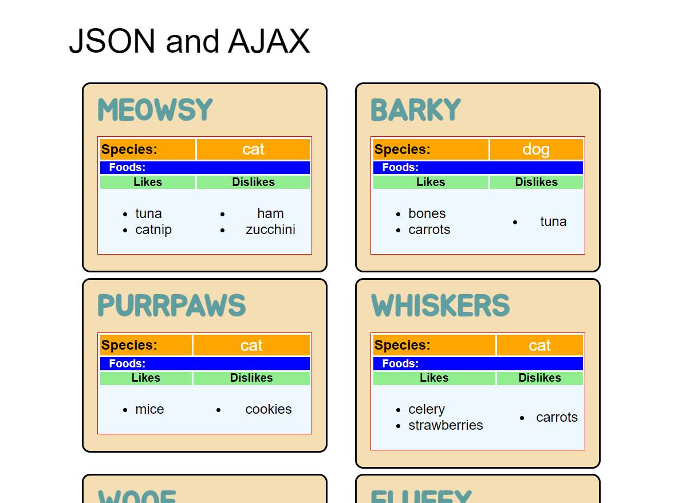

| INFO PROPERTY    | VALUE                                       |
| ---------------- | ------------------------------------------- |
| Program Name     | Demo: Ajax Information Gallery (Vanilla JS) |
| Public File Name | index.htm                                   |
| Local File Name  | ehCode_2018.06.13_demo_AjaxJson             |
| Date Created     | 06/13/18                                    |
| Date Modified    | --                                          |
| Version          | 1.01                                        |
| Programmer       | Eric Hepperle                               |

## Purpose:
Demonstrates grabbing and displaying data from JSON endpoints using AJAX and vanilla JavaScript.
    
## Usage:
1. Load the HTML page in a browser.
2. Click the button to load new objects.
3. Each object should display in a styled, floated block module.
    
## Sample results: 
[N/A]

## Requires:
* A web browser.
* REST API Web Service data locations:
    * https://learnwebcode.github.io/json-example/animals-1.json
    
## Demonstrates:
* Vanilla JavaScript
* AJAX
* XMLHttpRequest
* Parsing JSON
* REST API

## Based on this tutorial:
- Title: JSON and AJAX Tutorial: With Real Examples
- URL: https://www.youtube.com/watch?v=rJesac0_Ftw
- Channel: LearnWebCode

## Resources:
- Where to access json endpoint urls:
    * Fill Text: http://www.filltext.com/
- JavaScript Templating: handlebars.js
- Error Handling for AJAX?
